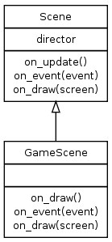
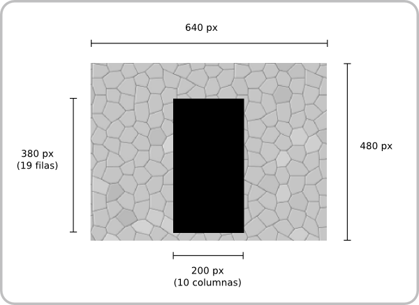

Diseño de la etapa 2
====================

En esta etapa se comienza a definir el modelo de las piezas, como
se representan en pantalla y cómo es su lógica.

Objetivos de la etapa
---------------------

Se debe crear una nueva escena, que de manera similar a las
anteriores etapas tiene que heredar de *Scene*:

Y en pantalla la escena solamente ofrece la posibilidad de mover
una sola pieza (similar a una letra L) y regresar a la escena
anterior, la de la etapa 1.

Esta es una previsualización del diseño visual:

La parte central, representado por la clase Board, tiene 
