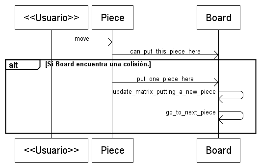

Diseño de la etapa 3
====================

Esta etapa tiene 2 grandes cambios, se generan las piezas restantes
y se implementa la colisión entre las piezas que han tocado el suelo
y la que controla el usuario.

Nuevas piezas
-------------

Cada una de las piezas tiene su *Mapa* de colisiones en el
directorio `mask`.

Para implementar el resto de las piezas solo se debe crear
una imagen y un mapa de colisión para cada pieza.

Este es el contenido del directorio `mask`:

* p0.txt
* p1.txt
* p2.txt
* p3.txt
* p4.txt
* p5.txt

Colisiones entre piezas
------------------------

Internamente la pieza tiene una estructura de colisiones que
podría colisionar con alguna pieza en reposo dentro del tablero.

Esta situación de colisión se verifica por parte del objeto `Board`. Este
objeto tiene una mapa completo de todas las piezas en reposo, y cuando
una pieza le consulta, si puede ocupar una parte del escenario, `Board`
recibe el mapa de la pieza y analiza posición a posición.

En esta etapa se agrega un nuevo mensaje de intercambio entre las
dos clases, cuando la pieza se suelta, el tablero recibe la orden
de ocupar parte del escenario con los datos de la pieza.

Este es un diagrama que refleja este intercambio de mensajes entre
ambos objetos:

..  <<Usuario>> -> Piece: move
    Piece -> Board: can_put_this_piece_here
    alt Si Board encuentra una colisión.
       Piece -> Board: put_one_piece_here
       Board -> Board: update_matrix_putting_a_new_piece
       Board -> Board: go_to_next_piece
    end

 
Aspecto visual del tablero
--------------------------

Si bien el objeto `Board` tiene una matriz con información de todos
los bloques ocupados y libres. También necesita una superficie visual
en donde se pueda observar las piezas en reposo.

Este criterio es parecido al que se utiliza en las piezas, aquí el
tablero tiene dos estructuras de datos: una matriz con información
*invisible* de las colisiones y una superficie que refleja esa
matriz pero visualmente.

El atributo que representa el aspecto visual de las piezas que
reposan es `Board.visual_matrix`. Este atributo señala a una
superficie que inicialmente es transparente, pero se dibuja
sobre ella conforme se deja reposar alguna pieza.
