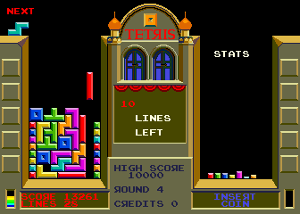
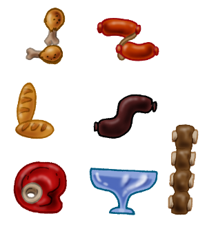
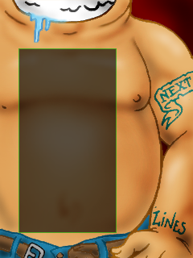

Documento de diseño
===================

El objetivo de este documento es definir brevemente en que consiste
el proyecto de videojuego *Asadetris* y cuales serán sus funcionalidades.

Introducción
------------

Asadetris es un videojuego de habilidad similar a *Tetris*: El jugador
debe acomodar figuras sobre un tablero para formar lineas
horizontales.

Esta es una imagen de la pantalla original del juego que nos sirve
de inspiración:

En este juego las piezas bajan a una determinada velocidad

Aspecto visual
--------------

Originalmente en el juego *Tetris* se utilizan piezas compuestas de
cuatro bloques. En *Asadetris* la piezas tienen un aspecto visual
muy diferente, las piezas son porciones de comida:

El escenario de juego es el sistema digestivo de una persona (bueh, sin
entrar en muchos detalles). A grandes rasgos el escenario se parece
a lo siguiente:

Adicionalmente el juego permite cambiar el aspecto visual desde
una opción del menú *Setup*.

Hay solo dos temas visuales, un modo ambientado en comida y otro
clásico con bloques de colores.

Escenas
-------

Todo el juego está dividido en diferentes escenas, aquí se enumeran
las mas importantes:

Presents
    Se muestra el logo inicial del grupo losersjuegos.
Main
    Es la pantalla del menú principal donde se muestra el logo del juego y un
    acceso al resto de las escenas.
Game
    La pantalla principal de juego con las fichas y el puntaje
Help
    Explica cómo jugar y los controles a utilizar.
Setup
    Menú de opciones para elegir el modo de video (ventana o pantalla
    completa), las opciones de audio y el tema visual.
Scores
    Muestra los puntajes mas importantes
About
    Muestra el nombre de todos los desarrolladores, agradecimientos y notas
    de la licencia (que es GPL y queremos que la gente copie juego !)
    

Controles
---------

Durante el menú del juego el usuario puede utilizar tanto
el teclado como el mouse.

En la escena de juego solo puede usar el teclado:

* Con los direccionales de izquierda y derecha puede mover la ficha horizontalmente.
* Para girar la pieza puede usar las teclas 'z' (giro hacia izquierda) y 'x'
  (giro hacia la derecha)
* El usuario puede hacer bajar la ficha de dos formas, pulsando *space* puede
  hacer bajar la ficha inmediatamente, mientras que pulsando el direccional
  hacia *abajo* solo acelera la caída progresivamente.

Niveles
-------

A medida que el usuario va realizando lineas en la pantalla, el
juego se hace cada vez mas difícil. Cada 10 lineas realizadas
el juego avanza un nivel y con ello hay un aumento de velocidad.

Al entrar en el juego el usuario puede elegir uno de tres
modos de juego: *fácil*, *medio* o *experto*. Lo único que
difiere de estos modos es el nivel inicial. Por ejemplo, si
el usuario ingresa en modo *medio* su nivel inicial será
5 (relativamente rápido).

Puntajes
--------

Se quiere brindar al usuario la posibilidad de ingresar su
nombre si ha realizado un buen puntaje. Para eso el juego
evalúa el puntaje del jugador una vez que pierde.

En el puntaje también cuenta el nivel de dificultad que ha
elegido. Esto cuenta porque la cantidad de puntos que hace
una persona jugando en modo difícil son mas valiosos que
alguien que inicia en modo fácil, por dar un ejemplo.

Esta diferenciación de modos se hace en la misma pantalla
de puntajes. Ahí se muestra el nombre de la persona, la
cantidad de lineas y el nivel de dificultad; todo esto
se muestra en una sola pantalla y se puede consultar
directamente ingresando a una opción del menú principal.
